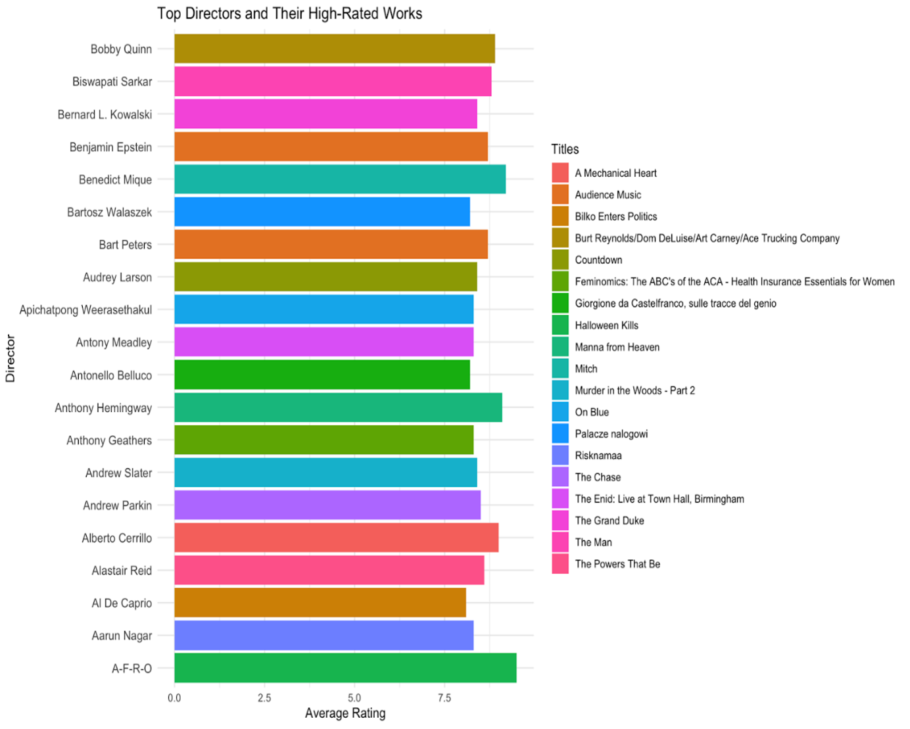
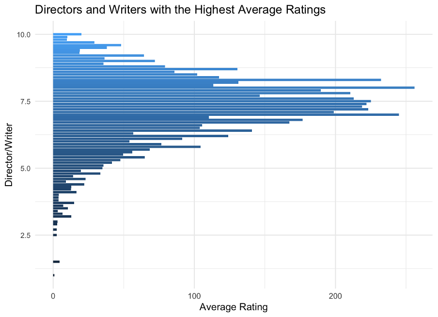

# INF6027: Introduction to Data Science

# Movie Success and the Role of Directors and Writers

## 📋 Overview
This study explores how directors and writers contribute to the success of movies and TV shows. By analyzing data from IMDb, the research highlights how the creative decisions made by the crew behind a project influence its ratings and popularity. Using data science techniques such as exploratory data analysis and predictive modeling, the study uncovers patterns that show certain directors and writers consistently deliver high-rated works.

## 🌟 Highlights
- Bobby Quinn and Biswapati Sarkar are amongst the directors who consistently produce movies and TV shows with high ratings.
- A color-coded analysis of movie genres and themes shows that successful directors work.
- Predictive models suggest that knowing the crew involved in a project can help predict its potential success.
- This research sheds light on the significant role of directors and writers in determining a film or TV show's fate.

## ❓ Research Questions
1. Which directors are known for consistently producing highly-rated movies and shows, and what are their most acclaimed works?
2. Can the success of a movie or TV show be predicted based on its directors and writers?

## 🔎 Key Findings
- **Consistently Successful Directors and Writers**: Certain directors, such as Bobby Quinn and Biswapati Sarkar, have a consistent track record of producing top-rated works across various genres.
- **Genre Diversity**: Successful directors tend to work across a variety of genres, showing their versatility and broad appeal.
- **Predictive Modeling**: The research found that movie success can be partially predicted based on the director and writer involved in the project. The involvement of well-regarded directors and writers is a key factor in a movie's or TV show's ratings and popularity.
- **Correlation**: The analysis revealed that there is no strong correlation between the number of votes and average ratings, suggesting that factors like the crew may play a more important role in predicting success.

## 📊 Results and Discussions

### 🎯 Key Results
### Top Directors And Their Highest Rated Works: 
- **Directors like Bobby Quinn and Biswapati Sarkar were found to have consistently high ratings for their works. The analysis showed that certain individuals are responsible for a large number of high-rated movies and TV shows**.

### Directors/Writers And Their Highest Average Ratings

- **Regression Model**: A predictive model demonstrated that knowing the director and writer behind a project could help predict its success, though other factors like marketing and actors also play a role.
- **Exploratory Data Analysis**: The analysis identified significant relationships between the average movie ratings and the influence of directors and writers. It showed that specific people were consistently responsible for top-rated works.

### 📝 Implications and Future Research
- **For Filmmakers**: The research suggests that collaboration between successful directors and writers increases the likelihood of creating films that are well-received by audiences and critics.
- **For the Industry**: The study provides valuable insights for studios and producers to optimize their resource allocation by selecting experienced and successful teams.
- **For Future Research**: This study lays the foundation for further exploration into other factors that affect a movie's success, such as actor performance, budget, and marketing strategies.

### 💡 Answering the Research Questions
- **RQ1: Which directors consistently produce highly-rated movies and TV shows?**
  - Directors like Bobby Quinn and Biswapati Sarkar were found to be consistently associated with high ratings for their projects.
- **RQ2: Can the success of a movie be predicted based on its Directors and Writers?**
  - The regression model showed that the involvement of certain directors and writers could partially predict the success of a movie or TV show.

## 📑 Conclusion

This research sheds light on the critical role of directors and writers in determining the success of movies and TV shows. By analyzing data from IMDb and using predictive models, the study identified key directors and writers whose work consistently received high ratings. While there are other factors that influence a film's success, the involvement of skilled and experienced directors and writers remains a significant predictor of success.

### ⭐️ Key Findings
1. **Consistently Successful Directors and Writers**: Certain directors and writers, such as Bobby Quinn and Biswapati Sarkar, were consistently associated with highly-rated works.
2. **Genre Diversity**: Successful directors often work across a variety of genres, showing their versatility.
3. **Predictive Insights**: Predictive modeling demonstrated that certain aspects of the crew (directors and writers) significantly influence a movie's success.

### ⚠️ Limitations
- **Dataset Size**: The dataset used may not include all works of a director or writer, potentially biasing the results.
- **Focus on Ratings**: The study primarily used ratings as a metric for success, which might not fully capture audience preferences or box office performance.
- **Complexity of Movie Success**: A movie's success is influenced by many factors beyond the director and writer, including the cast, production values, and marketing.
- **Overfitting**: The model showed strong predictive performance, but there’s a risk of overfitting, where the model too closely matches the training data.
  
### 🚀 Future Work
- Expand the dataset to include more movies and episodes, as well as other success metrics like box office revenue.
- Incorporate additional variables such as cast, marketing efforts, and audience demographics to improve prediction accuracy.
- Apply more advanced machine learning models to better understand the factors influencing movie ratings.
