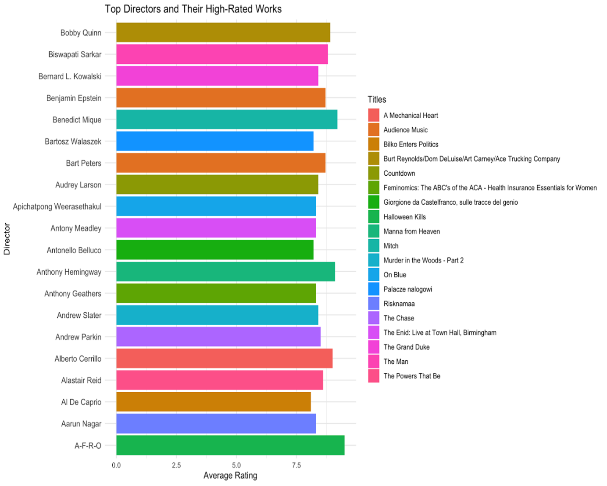
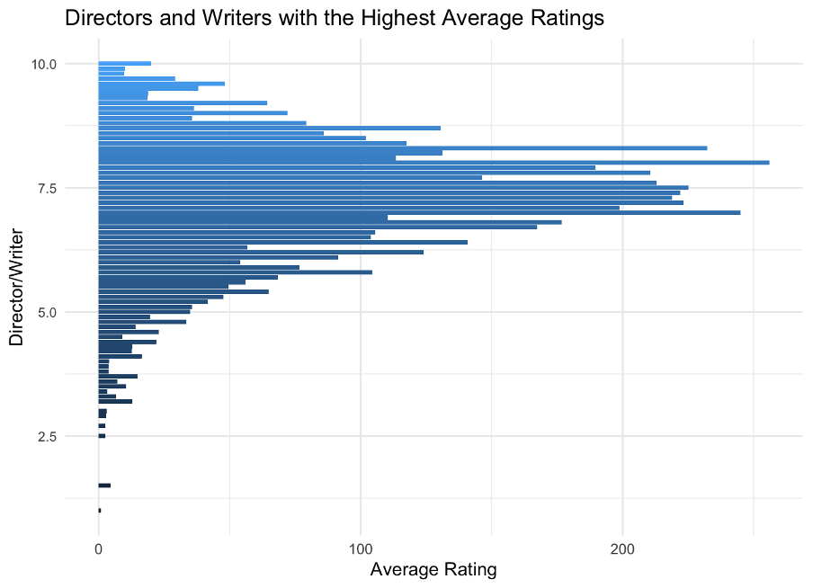

# 🎥 Data Science and Visualization: Exploring Movie Success

## 📋 Overview  
This repository combines insights from two distinct projects: **Introduction to Data Science (INF6027)** and **Data Visualization (INF4000)**. Both projects explore factors contributing to movie success, focusing on directors, writers, and genres, with analyses and visualizations derived from IMDb data.

---

## 🌟 Highlights  

### INF6027: Introduction to Data Science ([Page Link](https://adnanhasan20.github.io/IMDb-Data-Exploration/IDS))
- Investigates the role of directors and writers in influencing movie ratings and popularity.  
- Uses **exploratory data analysis** and **predictive modeling** to uncover patterns.  
- Key finding: Directors like Bobby Quinn and Biswapati Sarkar consistently produce highly-rated movies and TV shows.  

### INF4000: Data Visualization  ([Page Link](https://adnanhasan20.github.io/IMDb-Data-Exploration/visualisation))
- Explores genre trends across decades using advanced visualization techniques such as treemaps, bubble charts, and stacked area charts.  
- Highlights the relationship between genre popularity, average ratings, and production trends.  
- Key insight: Genre diversity contributes significantly to movie success over time.  

---

## 📊 Visualizations  

### 🎯 Key Visuals from INF6027  
#### Top Directors and Their Works  
  

#### Directors/Writers with High Ratings  
  

---

### 🎨 Key Visuals from INF4000  

#### Popular Genres Across Decades  
- **Treemap**: Visualizes the distribution of movies by genre for each decade.  
  

#### Top-Rated Genres  
- **Heatmap**: Highlights genres with high average ratings and their relation to the number of votes.  
  

#### Genre Contribution to Success  
- **Bubble Chart**: Depicts the relationship between total votes and average ratings for each genre, scaled by popularity.  
  

#### Movies Produced Over Decades  
- **Stacked Area Chart**: Tracks the production trends of genres across decades.  
  

---

 

## 🚀 Future Work  

- **Expand Dataset**: Include box office metrics, casting information, and marketing efforts.  
- **Advanced Analysis**: Apply machine learning for deeper predictive insights.  
- **Broader Scope**: Analyze cultural, temporal, and regional factors influencing movie success.  

---

This repository combines **data science** and **visual storytelling** to uncover the factors that make movies and TV shows successful.  
