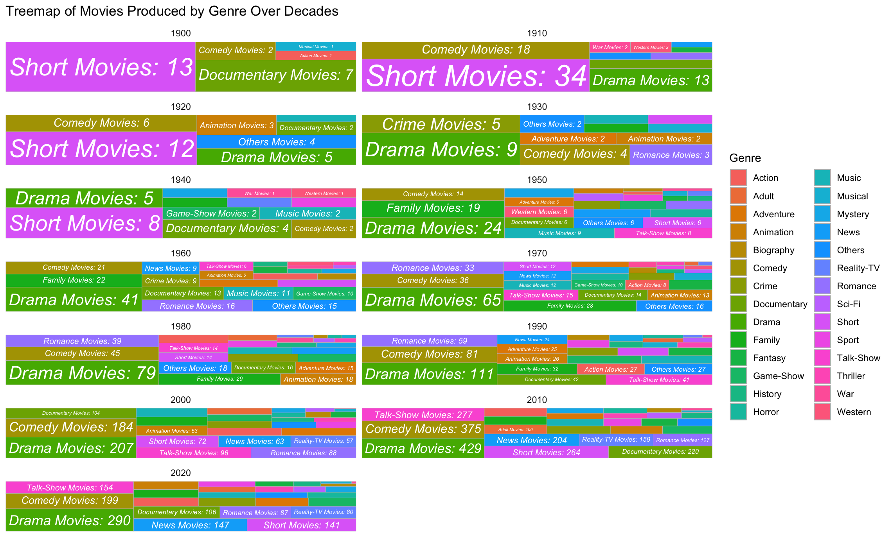

# INF4000: Data Visualisation

## Results and Discussions

### Popular Genres Across Decades

- Purpose: The **Treemap** visualizes the distribution of movie genres across decades.
- Details: Each rectangle represents a genre for a specific decade, with its size proportional to the number of movies produced. Different colors distinguish genres, allowing for an intuitive comparison of genre popularity trends over time.

---

### Popular Genres and Their Average Ratings

- Purpose: Highlights the average ratings of different genres.
- Details: A **Bar Chart** with genres on the x-axis and average ratings on the y-axis, using a gradient color scheme to emphasize the variation in ratings. Darker colors indicate higher ratings.

---

### No. of Movies Produced in Different Genres Across Decades

- Purpose: Shows the production trends of movies by genre over decades.
- Details: A **Stacked Area Chart** with the x-axis representing decades and the y-axis the number of movies. Each genre is represented by a different color, illustrating growth and changes in production volume over time.

---

### Genre Contribution to Movie Success

- Purpose: Explores the relationship between genres, average ratings, and total votes.
- Details: A **Bubble Chart** where the x-axis represents genres, the y-axis average ratings, and the size of each bubble indicates the total votes received. The chart reveals which genres tend to be more successful based on audience engagement and ratings.

---

### Conclusion

The visualizations collectively provide valuable insights into the evolution and impact of movie genres over time. The **Treemap** reveals the dominance of Western movies in earlier decades, followed by a gradual shift toward genres like Comedy, Drama, and, more recently, Action and Adventure. It also showcases the increasing diversity of genres over time. The **Top-Rated Genres** chart identifies Documentary and Biography as consistently high-rated genres, indicating that audiences often value content grounded in reality. The **Stacked Area Chart** demonstrates a significant rise in movie production since the 1970s, particularly in Drama and Comedy, highlighting the industry's growth and audience demand for varied genres. Finally, the **Bubble Chart** shows that genres like Action, Adventure, and Animation contribute substantially to movie success, with high ratings and engagement indicated by a large number of votes. Together, these results provide a comprehensive view of evolving genre trends, audience preferences, and the factors driving success in the film industry. 

